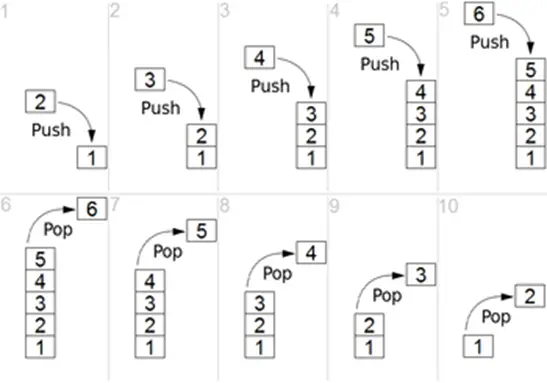

# Data Structures
I make this repo to practice data Structures concepts as well as C and CPP.
My goal here is to implement data Structures concepts in both language, and also using
different paradigms.

## Linked List

A linked list is a linear data structure, in which the elements are not stored at contiguous
memory locations. The elements in a linked list are linked using pointers as shown in
the below image.

- LinkedList contains elements called **Nodes**.
- Each Node carries a **data** field and a Link Field called **next**.
- Each Node is linked with anothe Node using its **next** link.
- Last Node carries a **next** as NULL to mark the end of the list.

#### Basic Operations

- **Append** - Add an Node at the beginning of the list.
- **Insert** - Add an Node at a given position position.
- **Print** - Print the entire list to stdout.
- **Delete** - Delete an Node at a given position.
- **DeleteValue** - Delete a Node that has the given value.
- **get** - Get the data of a node at given position.
- **(free)** - I use Free function only in C, to free the allocated memory in the program.

## Stack
A **stack** is an **abstract data type** with a predifined capacity or size. It is a simple
data structure that allows adding and removing elements in a particular order.

#### Basic Features
- 1-Stack is an **ordered list** of similar data type.
- 2-Stack is a **LIFO**(Last in First out) structure.
- 3-**push()** function is used to insert new element into the stack.
- 4-**pop()** function is used to remove an element from the stack.
    _Both insertion and deletion are allowed only on top of the stack_
- 5-Stack is in **Overflow** state when it is completely full, and is said in 
  **Underflow** state if it is completely empty.

#### Basic Operations
- **Push** - Add an element at the top of the stack.
- **Pop** - Remove an element from the top of the stack.
- **Top** - Get the element at the top of the stack.
- **isEmpty** - Check whether the stack is empty or not.
- **Print** - Prints the stack to the stdout.

## Queues
Queue is like stack, is also an abstract data structure. The difference between queue and stack is queue is open at both its ends. Hence it follows FIFO structure, i.e. the data inserted first will accessed and removed first. The data is inserted into the queue through one end (rear) and deleted from it using other end (front).

### Basic Operations
- **Push/Enqueue** - Add an element at the rear of the queue.
- **Pop/Dequeue** - Remove an element from the front of the queue.
- **Top/Peek** - Get the element at the top of the queue.
- **Print** - Prints the queue to the stdout.
- **isEmpty** - Check whether the queue is empty or not.

## Trees
Trees are abstract data types, that represent a hierarchical tree structured with a sef of connected nodes. Each node in the tree can be conneted to many other nodes called children, and chilren must be connected to exacltly one parent.

### Binary Search Tree
In this repo we are gonna see the BST or Binary Search Tree, is type of trees, but with different propreties.

- The left subtree of a node contains only nodes with keys lesser than the root node key.
- The right subtree of a node contains only nodes with keys greater than the root node key
- The left and right subtree each must be a binary tree.

### Basic Operations
- **addNode** - Add a node to the tree.
- **search** - Search for a node in the tree.
- **delete** - Delete a node from a tree.*(The hardest)*
