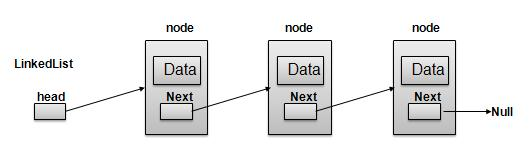

# Data Structures
I make this repo to practice data Structures concepts as well as c and cpp.
My goal here is to implement data Structures concepts in both language, and also using different paradigms.
## Linked List
Linked List is a sequence of Nodes which contains items. Each Node contains a connection
to another link.

- LinkedList contains elements called **Node**.
- Each Node carries a **data** field and a Link Field called **next**.
- Each Node is linked with anothe Node using its **next** link.
- Last Node carries a **next** as NULL to mark the end of the list.

#### Basic Operations

- **Insertion** - Add an element at the beginning of the list.
- **Deletion** - Delete an element using a given index.
- **Display** - Displaying complete list.
